# Deployment 7

## Goal:

The goal for this deployment is to **build, test,** and **deploy** a Java application using Jenkins. The Jenkins image will be run on a Docker container which is hosted by a AWS EC2.

## Prerequisite:

Knowing how to **ssh** into an AWS EC2 and manage credentials in Jenkins are essential in order to complete this lab. 

## Requirements:

* AWS
	* EC2
	* ECR
	* ECS Cluster
* Docker
* Jenkins 

## Procedure:

### Step 1: [AWS EC2](https://aws.amazon.com/ec2/?ec2-whats-new.sort-by=item.additionalFields.postDateTime&ec2-whats-new.sort-order=desc) Set up

1. Created a [EC2](https://docs.aws.amazon.com/AWSEC2/latest/UserGuide/EC2_GetStarted.html) with a ubuntu ami on aws. 

2. [ssh](https://docs.aws.amazon.com/AWSEC2/latest/UserGuide/AccessingInstancesLinux.html) into EC2

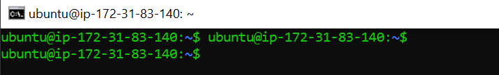

3. [Install docker](https://docs.aws.amazon.com/AmazonECS/latest/developerguide/docker-basics.html) onto EC2:

  * Make a bash file
 ```
 $ nano docker_install.sh 
```

  * Copy and paste the code below in the [bash file](https://github.com/ibrahima1289/deploy7/blob/main/docker_install.sh) linked in this repo.
  
  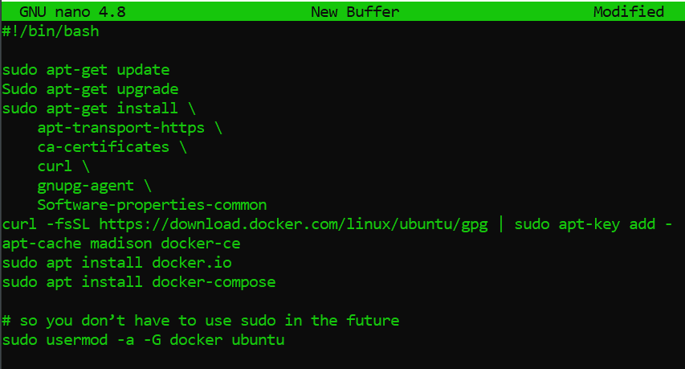

4. Make the bash file executable
  ```
  Sudo chmod +x docker_install.sh
  ```
5. Make sure you are in the directory where the bash file is before you run the bash file.
  
  * Otherwise, specify the path where the bash file is.
  
  ```
  $ ./docker_install.sh
  ```

6. Exit and ssh back in.

7. Make sure you have Java installed (we used version 11): run the command below:
```
$ sudo apt install openjdk-11-jre-headless
```

 
 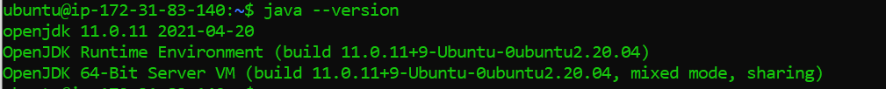
 
### Step 2: Pipeline script

1. Create a [github](https://docs.github.com/en/get-started/quickstart/create-a-repo) repo.

2. Create [Jenkinsfile](https://github.com/ibrahima1289/deploy7/blob/main/Jenkinsfile) on that github repo.

* Paste the code from the [pdf](https://github.com/ibrahima1289/DEPLOY07_ECS/blob/main/Deployment%237%20(1).pdf) into the jenkinsfile.

3. Create a [Dockerfile](https://github.com/ibrahima1289/deploy7/blob/main/Dockerfile) on your github that has the instruction to create a Java application.

4. Add the jar file to the repo.

### Step 3: [AWS ECS](https://aws.amazon.com/ecs/) Set up

**Creating a docker image and deploying it to AWS**

1. Pull the Jenkins image from dockerhub by running this command:
```
docker pull jenkins/jenkins
```

2. Create [ECS](https://docs.aws.amazon.com/AmazonECS/latest/developerguide/clusters.html) Fargate Cluster

```
Elastic Container Service -> Clusters -> Create clusters -> Select Template (Net. Only) -> Cluster name -> Create 
```

3. Create an [ECR](https://aws.amazon.com/ecr/) (Elastic Container Registry) registry

 * We will use this repo to store our Jenkins image later.
  
 * Flollow the steps below:
  
  ```
  AWS -> Elastic Container Registry -> create a repository -> Public -> Repo name (same as docker image) -> create repo -> ARM 64 (Optional)
  ```
		
 * We will need the [URI](https://aws.amazon.com/about-aws/whats-new/2018/07/amazon-workspaces-now-supports-custom-login-workflows-with-a-uri/) to push the image.

4. Use the command below to install `awscli` version 2 which will allow AWS command to run
```
$ sudo curl "https://awscli.amazonaws.com/awscli-exe-linux-x86_64.zip" -o "awscliv2.zip"
$ sudo unzip awscliv2.zip
$ sudo ./aws/install
```

* If you have an error, run the command below"
```
$ sudo ./aws/install --update
```

* Finally run the command below to verify the installation:
```
$ aws --version
```

* You should see: 

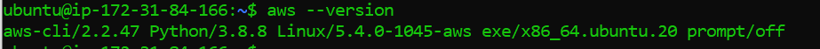


5. Give Docker CLI permission to access your Amazon account

First configure the **key/Access key ID** by typing:
```
$ aws configure
```

And follow the steps of configuration.

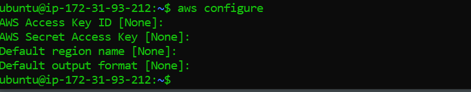

Then, use the command below to login into AWS account:

```
$ aws ecr get-login-password --region [your_region] | docker login --username AWS --password-stdin [your_account_ID_number].dkr.ecr.[your_region].amazonaws.com
```	

* You should see: **Login Succeeded**.

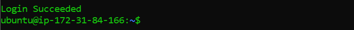

6. Now, we are going to push the Jenkins image into our **ECR** repository.

* Tag the image

```
$ docker tag [name of the app] [use the uri here]
```

* Push up the docker image to the repository (ECR)

```
$ docker push [aws-id].dkr.ecr.us-east-1.amazonaws.com/[name-of-app]
```	

* Also, you can find the commands in the **ECR** repository by clicking on **View push commands**. See pictures below.

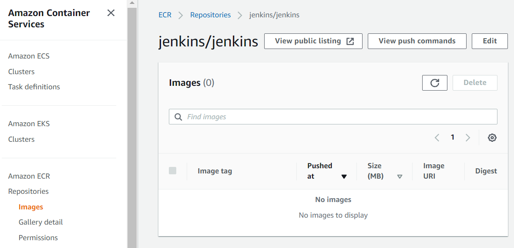
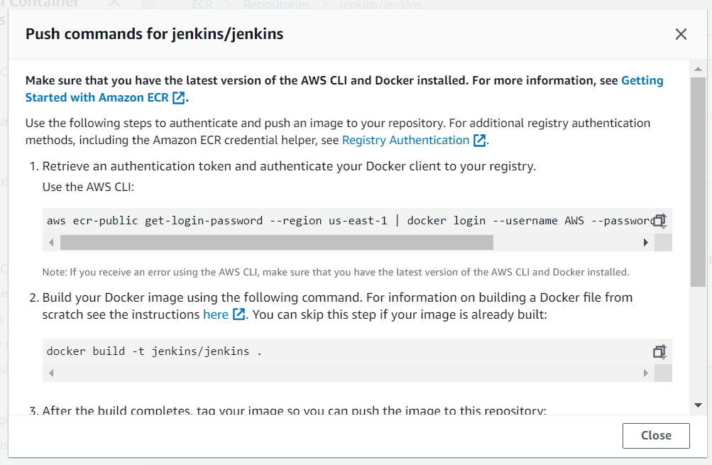

Finally, you will see the Jenkins image in the repository like the picture below:

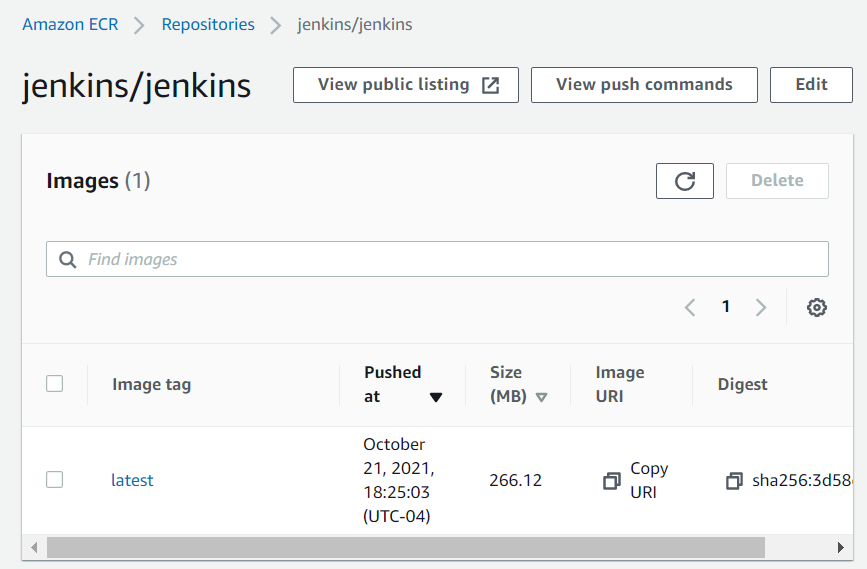

7. Copy the **URI** from the image that was pushed up. We will need for the following tasks.

8. Create a ECS Task definition

```
Task Definition -> create new task definition -> Fargate -> name -> task role -> Network mode	-> task memory/cpu -> add container (paste URI in Image) -> Port Mapping 8080 -> add -> create
```

9. Paste in the URI and fill in the required/necessary fields (Port mapping to 8080)

10. Run the task in your cluster

```
Task Definition -> Select active task you want to run -> Actions -> Run Task -> Launch type:Fargate -> Custer: set to cluster created for the app -> default vpc -> subnet -> Auto-assign public IP: ENABLED -> security group (custom tcp:8080) -> Run Task
```

11. Make sure you edit the **security group** to allow port 8080 (or the port you are using).

12. Copy the public IP of the EC2, go to your browser, and and type:
```
pubilc_IP:8080
```

To get the Jenkins password, go to logs in **ECS** cluster. You will find the ***AdminPassword***. 

Or, run:
```
docker run jenkins_image_name
```

And, install suggested plugins just like in [docker-assignment](https://github.com/ibrahima1289/docker-assignment).

13. Install docker pipeline plugin and AWS EC2 plugin in Jenkins.

14. Generate an [access token](https://docs.docker.com/docker-hub/access-tokens/) from dockerhub.

* Follow the steps provided by [dockerhub](https://docs.docker.com/docker-hub/access-tokens/) when you generate your token

* Add the token as a password to your Jenkins global credentials.

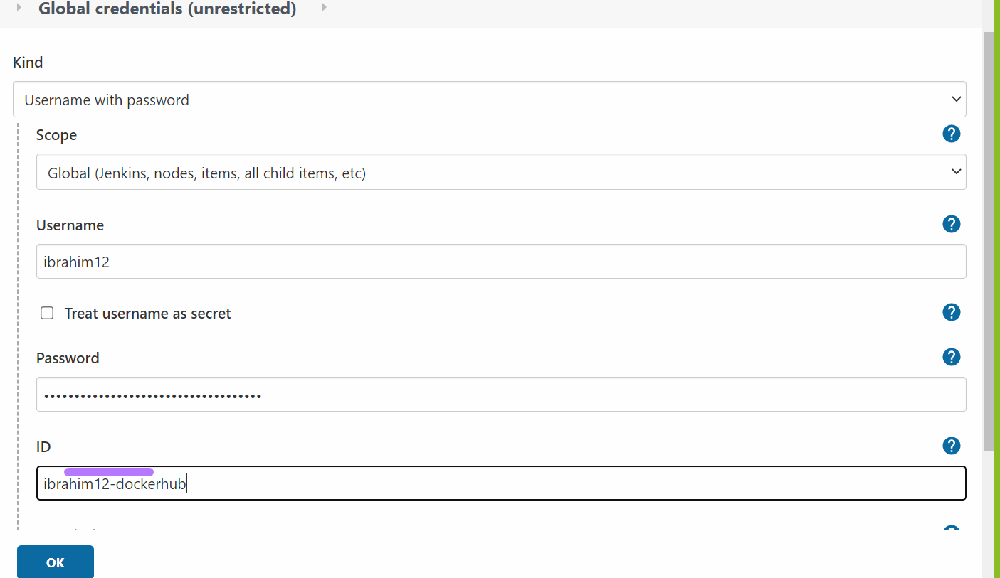

15. Create a multi branch pipeline on your Jenkins.

16. Edit the Jenkins file because since the old file does not tell Docker to do anything.

17. Create a new job in Jenkins and make a new agent. Refers to [Deployment 6](https://github.com/ibrahima1289/DEPLOY6_FE) to create an agent.

18. Build the pipeline and it should be successfull!!!

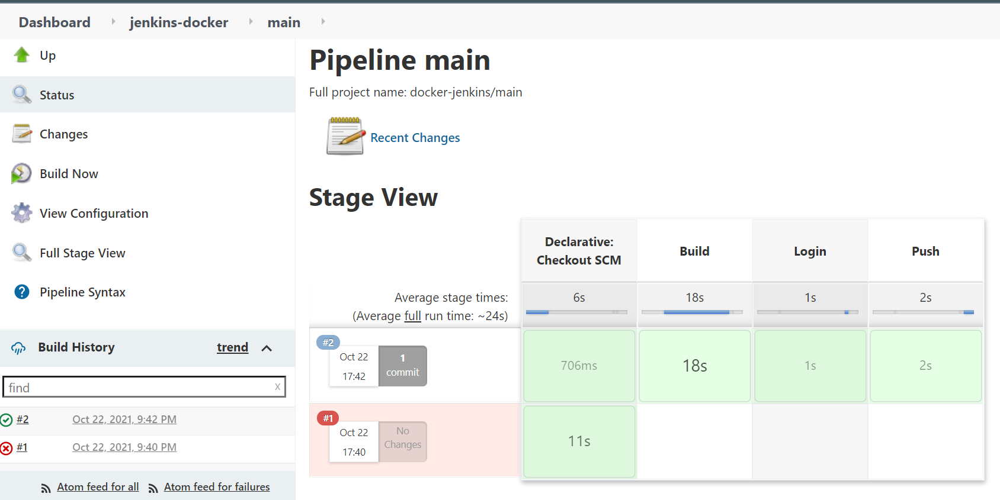

***NOTE***: *make sure your label for the agent matches the label in the Jenkinsfile.*

19. Now that you finish, you should **shut down the app** in order to avoid a bill from AWS:

```
Go to -> ECS -> Clusters -> fargate-cluster -> Tasks -> Check box of the runnung task -> Stop
```


# Sources visited:

1. https://hub.docker.com/r/jenkins/jenkins<br>
2. https://dev.to/kamalhossain/how-to-run-docker-containers-in-aws-ec2-3bh0<br>
3. https://towardsdatascience.com/deploying-a-docker-container-with-ecs-and-fargate-7b0cbc9cd608<br>
4. https://medium.com/@asepmaulanaismail/simple-shortcut-to-install-docker-in-ubuntu-using-shell-script-59cc9e89b47a<br>


